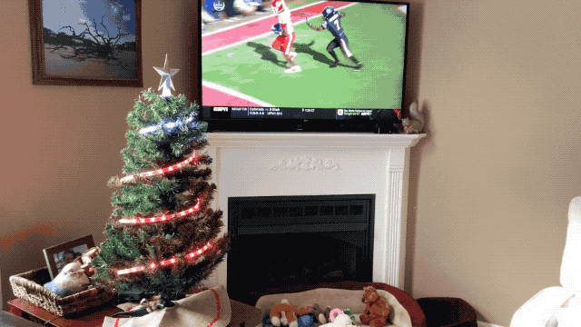

# Tree Divided 🎄🏈

This project uses the hardware from my NeoPixel tree: 

* [https://github.com/twstokes/neopixel-tree](https://github.com/twstokes/neopixel-tree)
* [https://www.tannr.com/2018/01/08/neopixel-led-christmas-tree/](https://www.tannr.com/2018/01/08/neopixel-led-christmas-tree/)

## Idea

Every year Clemson plays USC for their state rivalry game. I pull for Clemson and my wife pulls for USC, so we're what you call a "House Divided". Since this game takes place on or after Thanksgiving, it's a great time to incorporate the LED Christmas tree and troll my spouse!

The tree works like this:

* When a team scores, it plays their fight song and lights up with their primary and secondary colors.
* The lights on the tree are distributed by the ratio of points. When it's tied, they each get 50% of the lights. If Team A has 2/3 more points, they get 2/3 more lights in their color.
* The ring under the star at the top of the tree is the color of winning team. If they're tied, it's split.
* When the game is finished, the tree is the color of the team that won.

## Software

I used Golang for the software since I primarily write code in [another language](https://swift.org/) and want to get better at it. It makes use of various interfaces to aid in testing and abstration:

* The Fetcher interface gets the latest game state from a data source
* The Player interface plays audio at the given path
* The Illuminator interface controls a light source (in this case the LED tree)

The source code for a local data fetcher is included in this repo only. The remote fetcher I built may or may not have used an API meant for this sort of consumption. It simply fetched from a remote data source, unmarshalled a JSON data structure, and supplied what the Fetcher interface needed.

The code runs on a Raspberry Pi and communicates with the MCU via serial. An [iHome IBT63 speaker](https://www.ihomeaudio.com/support/product/iBT63BC/) is used to play audio from the Raspberry Pi. I didn't use the Bluetooth connection and instead used the shared power and audio connector, plugging one end into the RPI's stereo jack and the other into the USB port.

I cross-compiled from my Mac using the `rpi.sh` script in the executable's directory.

## Firmware

* Uploaded using [PlatformIO](https://platformio.org/)
* Runs on a NodeMCU ESP8266